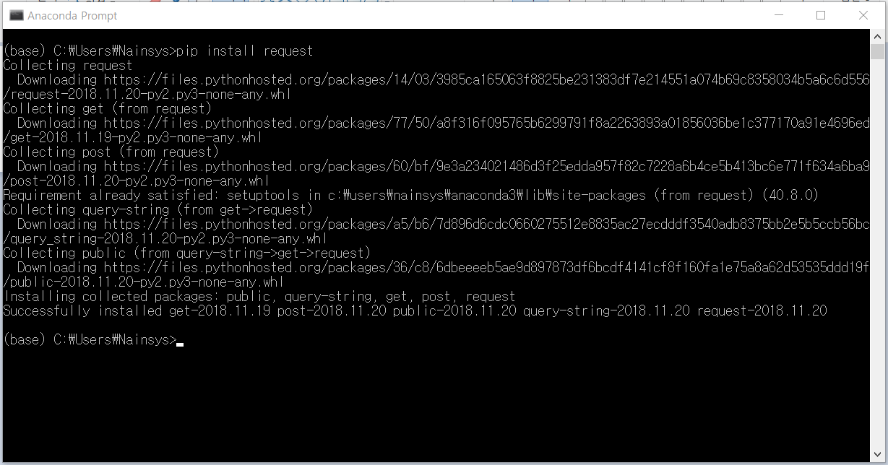

# 4.7.5. 기본 내장 모듈

파이썬에는 다음과 같은 기본 내장형 모듈들이 제공됩니다.

| 모듈 이름  | 설 명                                                                                                                                                                                                 |
| ------ | --------------------------------------------------------------------------------------------------------------------------------------------------------------------------------------------------- |
| sys    | 
파이썬 시스템과 대화를 가능하게 합니다.:

exit() - 종료!

argv - 명령어 라인 인수에 접근합니다.

path - 시스템의 경로에 접근합니다.

ps1 - '>>>' 파이썬의 프롬프트를 변경합니다.!
                                                  |
| os     | 
운영체제와 대화를 가능하게 합니다.:

open - 파일을 연다

system - 시스템 명령어를 실행합니다.

mkdir - 디렉토리를 생성합니다.

getcwd - 현재의 작업 디렉토리를 찾는다
                                                           |
| string | 
문자열을 처리할 수 있도록 해준다

atoi/f/l - 문자열을 integer/float/long 로 변환합니다.

find - 하부문자열을 탐색합니다.

split - '단어'의 부분을 이용합니다.

upper/lower - 대소문자 변환
                                   |
| re     | 
문자열을 유닉스 스타일로 다루도록 해 준다 정규 표현식 regular expressions

search - 문자열의 어느 곳엔가 있는 패턴을 탐색합니다.

match - 오로지 처음부터 찾는다

split - 패턴으로 분리된 필드의 부분을 이용합니다.

sub,subn - 문자열 바꾸기
     |
| math   | 
많은 수학적 함수에 접근하도록 해준다:

sin,cos 등등 - 삼각 함수

log,log10 - 자연로그 그리고 상용로그

ceil,floor - 상한값과 하한값

pi, e - 자연 상수
                                                               |
| time   | 
시간(그리고 날짜) 함수

time - 현재의 시간을 획득합니다. (초단위로 표현된다)

gmtime - 시간을 초단위로 UTC (GMT) 로 변환합니다.

localtime - 대신에 지역 시간으로 변환합니다.

mktime - 지역시간의 반대

sleep - 프로그램을 n 초 동안 멈춘다
 |

파이썬에는 이 외에도 수십가지의 모듈이 제공되고 있으며 또 많은 모듈들을 다운받아 설치 할 수 있습니다.

PIP를 사용하여 파이썬으로 작성된 패키지를 설치할 수 있습니다. 새로운 패키지를 설치하기 위해서는 ‘pip install \[패키지명]’을 이용합니다.

예제로 데이터를 수신하기위해 많이 사용하는 ‘request’ 패키지를 설치하여 보겠습니다. 아나콘다 프롬프트 창에서 ‘pip install request’라고 입력한 후 실행하면 다음과 같이 설치가 됩니다.

