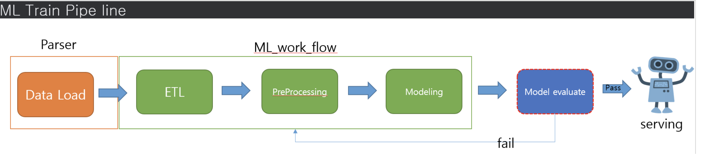

# 신한은행

<figure><figcaption></figcaption></figure>


<figure><figcaption></figcaption></figure>


11/09, 신한 죽전데이터센터 방문하여 설치된 DTI 아키텍처 확인 (제안서와 차이 없음)&#x20;

&#x20;          신한 DTI 운영방안 마련을 위한 DS 방문 후 계획서 마련예정

```
11/15일, 신한DS 회의내용 : dti 서비스 개선 계획을 위한 회의요약

- 테스트파이프라인 운영계획 작성하여 신한은행, 신한DS 공유
   신한은행 : 업무보고
   신한DS : 업무 협조 (dti 정탐율 개선을 위함)
   
- DTI 구성도 공유요청(신한DS, dti시스템 수집되는 로그 등이 어떻게 수집되는지 확인하고자 함)
- SIEM 장비 (splunk 이용중)로 dti시스템 시스로그를 연동할 수 없는지 문의 (514 연동포트)
- SIEM 장비 (splunk 이용중)에서 dti시스템으로 이벤트로그 등을 연동여부 확인
  (방화벽 정책 등 확인을 통해 연동되는 서비스를 오픈하는 과정 필요_신한은행담당자)
  
- 신한DS 관제이벤트 분석보고서(신한은행 보고서) 확인
  (신한은행에는 지도학습의 이벤트는 3가지 유형 제외하고 보고 되며, 
   탐지한 내역을 엑셀 등을 출력 후 정/오탐 라벨링하고 일별/월별정탐율, 오탐율  보고)
  
- 신한DS 보안관제 포인트 : 인터넷망, 웹해킹의 공격유형에 대한 모니터링을 하며, 
  단순크롤링, 봇에 의한 스캔성 이벤트는 url 등을 확인하여 오탐으로 처리하고 있으며, 
  TIP패턴 중 python, request 경우, 오탐으로 발생한 건과 정탐으로 발생한 건 섞여있어
  오탐율을 낮추고 정탐율을 높이기 위한 방안을 모색하기 위한 운영계획 수립 필요
  (새로운 모델 적용할 수있는 테스트파이프라인에 적용하여 테스트를 통해 신한DS 와 
  이벤트건 협조를 통해 진행)
  
- 관제제외 이벤트 3건 :
  Exposure of Sensitive, Forceful Browsing, Client Server Protocol Manipulation
  에 대한 방안으로 본사내부에서 테스트하고 있는 내용(모델)을 테스트파이프라인을 통해 
  적용하기위한운영계획서를 마련하여 공유하고, 작업시 신한DS측과 이벤트 내용, 정책 등 공유하여 협조

- 신한DS측에서 이벤트 예외처리를 할 수 있는 기능이 있느냐의 질문에는
  DTI 시스템에서는 사용자가 이벤트 예외처리를 할 수 있는 기능은 없다
  매주 유지보수를 통해 모델등 성능 패치를 통해 수정해 가고 있다.

- 신한DS 분석보고서에 첨부되는 보안이벤트처리내역에 대한 자료 공유 요청건 
  (신한은행 담당자 반출여부 확인후, 가능한 방법으로 전달해 주겠다)
  (필요하면 신한DS 보안관제센터내 비상주 인력이 작업할 수 있는 공간이 있음)
  (분석된 내용 교차 검증 차원)


------------------------------------------------------------------------


1. 신한DS 보고서 양식 및 정/오탐 판별
- dti 보고서 탐지결과를 csv로 다운로드하여 정/오탐 라벨만 추가하여 보고 중
- DS 보고서에서 빠지는 공격 유형 3가지 Exposure of Sensitive, Forceful Browsing, Client Server Protocol Manipulation
    -> 오탐률이 높아 전 담당자인 박정욱 수석때부터 보고가 안되고 있고 인수인계 이후 
    신한DS에서도 제외되어 보고하고 있음
- 신한금융지주에는 이상행위탐지(비지도학습)만 보고되고 있음
    -> 금융지주는 이상행위탐지에서 탐지된 패킷들의 탐지정확도(%)위주로만  성능 판단

- 신한 DS는 탐지된 공격에서 크롤러(봇), 접근 url 정상접속 가능(스캐닝) 등은 오탐으로 판별
    -> SW  취약점을 스캔하는 봇이나 툴은 예외로 정탐으로 판별
    -> 타 솔루션에서는 DS 쪽에서 정상 URL을 예외처리 하기 때문에 탐지율이 높게 나옴
- 특정키워드는(예: python, request, curl ...)오탐도 많지만 정탐 건수도 많음


2. 향후 계획
- 신한은행 테스트 파이프라인에 각 모델 테스트(신한 리팩토링 버전, Distil-bert, mobile-bert)
- 모델 테스트 전 학습데이터 및 검증 데이터 생성을 위한 라벨링 투입
- 테스트 진행 과정의 히스토리를 신한DS와 공유해가며 모델 성능 고도화 후 모델 교체 진행


3. 신한DS 요청 사항
- 구성도 공유(장비 구성 현황)
- 테스트 계획서(테스트 파이프라인에 적용할  각 AI 모델들의 내부 벤치마크 테스트 결과 및 모델 간 차이점 첨부)
- syslog를 통하여 splunk와 연동가능한지 확인
- 신한금융지주는 이상행위탐지를 중점적으로 보고있는데 최근 dti에서 이상행위탐지건수가 일정하고 건수가 줄어들어서 전체모수(탐지건수가)가 증가했으면 함
    -> 3건 ~ 110여건 정도로 매 월마다 탐지 건수가 일정하지 않음(10월 3건탐지) 
    -> 현재 이상행위탐지모델(esoinn) 점검이 필요할 것으로 예상


4. 씨티아이랩 요청 사항
- 신한DS에서 정/오탐 라벨링된 로그파일 반출
    -> 신한은행에서 반출이 안된다고 할 경우 신한DS에서 비상주하며 분석 진행

```

